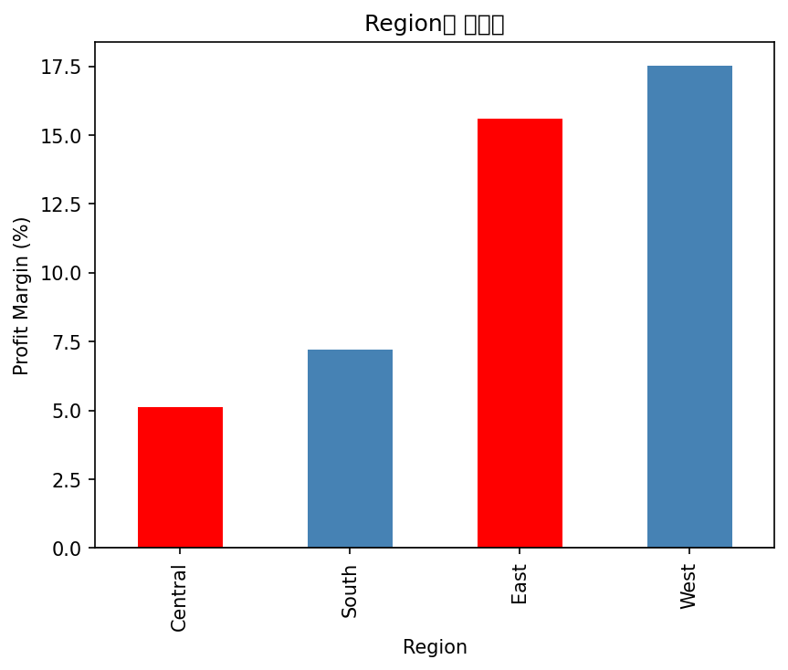
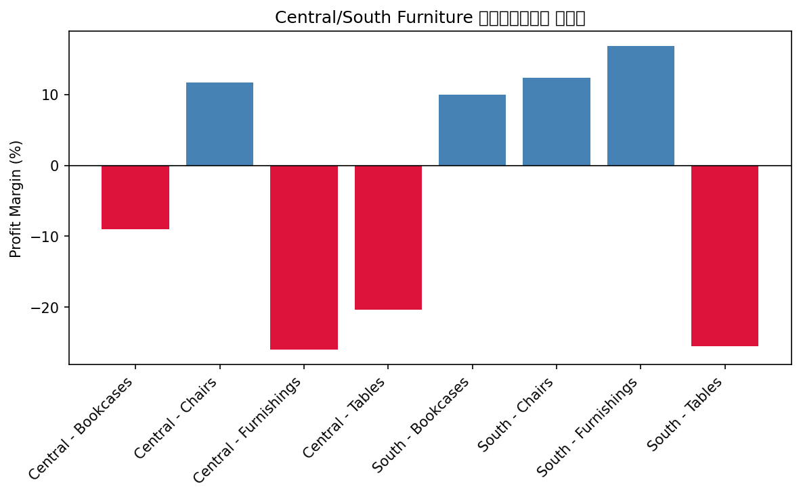
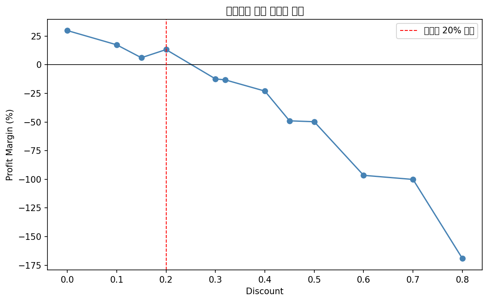

# 지역별 수익성 저하 원인 분석 — Superstore 매출 데이터

> 마케팅팀 요청으로 진행한 지역별 매출/수익성 분석 프로젝트입니다. 데이터 추출(SQL)부터 원인 분석, 가설 검증, 개선 제안까지 데이터 분석 과정을 단계적으로 수행했습니다.

## 목차
- [프로젝트 배경](#프로젝트-배경)
- [데이터](#데이터)
- [분석 방법론](#분석-방법론)
- [분석 과정 및 결과](#분석-과정-및-결과)
- [결론 및 제언](#결론-및-제언)
- [기술 스택](#기술-스택)
- [한계 및 향후 개선 방향](#한계-및-향후-개선-방향)

---

## 프로젝트 배경

마케팅팀으로부터 다음과 같은 요청을 받았다고 가정하고 분석을 진행했습니다.

> "요즘 지역별로 매출 편차가 있는 것 같습니다. 몇몇 지역은 실적이 계속 안 좋다는 얘기가 나오는데, 어떤 지역이 문제인지, 왜 그런지 데이터로 봐주실 수 있을까요?"

요청이 다소 모호했기 때문에(기준 지표, 비교 기간 등이 불명확), 실제 업무 흐름을 재현하여 아래와 같이 요구사항을 먼저 구체화했습니다.

| 항목 | 확정된 기준 |
|---|---|
| 분석 기간 | 최근 1년 (2017-01-01 ~ 2017-12-30) |
| 주 지표 | 이익률 (Profit Margin) |
| 보조 지표 | 이익(Profit), 매출(Sales) |
| 비교 방식 | 지역(Region) 간 상대 비교 |

## 데이터

- **출처**: [Kaggle - Sample Superstore](https://www.kaggle.com/datasets/vivek468/superstore-dataset-final)
- **규모**: 원본 9,994건 / 2017년 필터링 후 3,312건
- **주요 컬럼**: Region, Category, Sub-Category, Order Date, Sales, Profit, Discount

## 분석 방법론

```
SQL (SQLite)           →  Pandas                →  통계 검증
필요한 컬럼/기간만 추출     그룹별 집계, 파생지표 계산    상관관계 분석
```

- **SQL**: 원본 데이터에서 분석에 필요한 컬럼과 기간(2017년)만 필터링하여 추출
- **Pandas**: 지역/카테고리/서브카테고리별 매출·이익·이익률 집계 및 비교
- **가설 검증**: 할인율과 이익률의 상관관계를 상관계수로 검증

## 분석 과정 및 결과

### 1. 지역별 매출·이익·이익률

| Region | 이익률 |
|---|---|
| Central | 5.13% |
| South | 7.20% |
| East | 15.60% |
| West | 17.51% |

**Central, South가 East, West 대비 이익률이 뚜렷하게 낮음** (약 8~10%p 차이) → 두 지역의 카테고리별 추가 분석 필요



### 2. Central·South의 카테고리별 분석

- **Central**: Furniture(-2.88%), Office Supplies(0.15%) 모두 저조
- **South**: Furniture(-1.53%)만 손실, 나머지 카테고리는 양호

→ 두 지역이 "같은 이유"로 안 좋은 게 아니라, **Central은 구조적으로 여러 카테고리가 부진**하고 **South는 Furniture 하나가 원인**이라는 차이를 확인

### 3. Furniture 서브카테고리 분석

| Region | Sub-Category | 이익률 |
|---|---|---|
| Central | Furnishings | -26.01% |
| South | Tables | -25.51% |
| Central | Tables | -20.42% |
| Central | Bookcases | -9.06% |

**Tables가 Central·South 양쪽 모두에서 문제로 확인**됨



### 4. Central Office Supplies 서브카테고리 분석

- Binders(-18.75%), Appliances(-3.51%) 손실
- Supplies(2.67%), Storage(2.99%)는 이익은 나지만 타 카테고리 대비 저조

### 5~7. 가설 수립 및 검증: 할인율과 이익률의 관계

**가설**: 할인율이 높을수록 이익률이 낮아진다

- 전체 데이터 기준 할인율별 이익률을 집계한 결과, **할인율 30% 지점부터 이익률이 마이너스로 전환**되는 뚜렷한 패턴 확인



- 분석 대상 8개 지역×서브카테고리 조합의 평균 할인율과 이익률 비교 결과, Central Furnishings(38%)·Tables(29%)·South Tables(27%) 등 손실이 큰 그룹일수록 할인율도 높게 나타남
- **상관계수 검증**

| 대상 | 상관계수 | 해석 |
|---|---|---|
| 전체 데이터 (할인율 구간별) | **-0.96** | 매우 강한 음의 상관관계 |
| Central/South 문제 서브카테고리 (8개 그룹) | -0.49 | 중간 수준의 음의 상관관계 |

→ **할인 정책은 전사 차원에서 이익률에 강하게 영향을 미치는 핵심 요인**으로 확인됨. 다만 Binders, Appliances처럼 할인율이 높아도 상대적으로 선방하는 예외가 존재해, 문제 카테고리 내에서는 할인율만으로 전부 설명되지 않음 (표본 8개로 제한적)

## 결론 및 제언

1. **할인율 상한선 설정 제안**: 전사 데이터 기준 할인율 20%까지는 이익률 11% 이상 유지되나, 30% 이상부터 마이너스로 전환됨. **할인율 상한을 20~25% 수준으로 설정**할 것을 제안한다.

2. **매입원가 별도 점검 필요**: Binders, Appliances는 할인율이 높은 편(45~58%)임에도 다른 고할인 카테고리 대비 손실 폭이 작아, 할인 정책보다 **매입 단가 자체의 문제일 가능성**이 있다. 구매팀과 협의하여 공급업체별 매입가를 별도로 검토할 필요가 있다.

3. **Tables 서브카테고리 우선 점검**: Central, South 두 지역에서 공통으로 손실 폭이 가장 큰 서브카테고리로, 할인 정책 조정의 최우선 대상으로 제안한다.

## 기술 스택

`Python` `Pandas` `SQLite` `Matplotlib` `SQL`

## 한계 및 향후 개선 방향

- Central/South 문제 그룹 상관관계 분석의 표본이 8개로 적어, 통계적 유의성 검증(p-value)을 통한 추가 검증이 필요함
- 할인율 외에 배송 방식(Ship Mode), 고객 세그먼트(Segment) 등 다른 변수와의 관계는 분석하지 않았으며, 후속 분석 과제로 남김
- 현재는 정적 분석 결과물이며, 향후 Tableau/Power BI를 활용한 인터랙티브 대시보드로 확장 예정 (별도 프로젝트로 진행)
